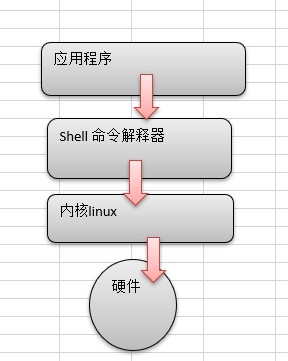
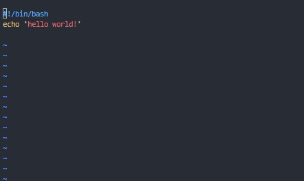

# Shell简介

## 1. Shell基础

* Shell 是一个用 C 语言编写的程序，它是用户使用 Linux 的桥梁。Shell 既是一种命令语言，又是一种程序设计语言。
* Shell 是指一种应用程序，这个应用程序提供了一个界面，用户通过这个界面访问操作系统内核的服务。
* Ken Thompson 的 sh 是第一种 Unix Shell，Windows Explorer 是一个典型的图形界面 Shell。

## 1.1 什么是shell

> Shell是一个命令行解释器，它为用户提供了一个向Linux内核发送请求以便裕兴程序的界面系统级程序，用户可以用Shell来启动、挂起、停止甚至是编写一些程序。

### 1.2 shell脚本

> Shell 脚本（shell script），是一种为 shell 编写的脚本程序。
> 业界所说的 shell 通常都是指 shell 脚本，但读者朋友要知道，shell 和 shell script 是两个不同的概念。

### 1.3 Shell 环境

>Shell 编程跟 JavaScript、php 编程一样，只要有一个能编写代码的文本编辑器和一个能解释执行的脚本解释器就可以了。

* Linux 的 Shell 种类众多，常见的有：
  * Bourne Shell（/usr/bin/sh或/bin/sh）
  * Bourne Again Shell（/bin/bash）
  * C Shell（/usr/bin/csh）
  * K Shell（/usr/bin/ksh）
  * Shell for Root（/sbin/sh）
* 本教程关注的是 Bash，也就是 Bourne Again Shell，由于易用和免费，Bash 在日常工作中被广泛使用。同时，Bash 也是大多数Linux 系统默认的 Shell。
* 在一般情况下，人们并不区分 Bourne Shell 和 Bourne Again Shell，所以，像 #!/bin/sh，它同样也可以改为 #!/bin/bash。

## 2. Shell脚本的运行

### 2.1 脚本的格式

* 脚本以#!/bin/bash 开头

### 2.2 脚本的执行

1. 赋予用户脚本执行权限
     * chmod +x ./test.sh  #使脚本具有执行权限
     * ./demo.sh
     * 注意，一定要写成 ./demo.sh，而不是 demo.sh，运行其它二进制的程序也一样，直接写 test.sh，linux 系统会去 PATH 里寻找有没有叫 demo.sh 的，而只有 /bin, /sbin, /usr/bin，/usr/sbin 等在 PATH 里，你的当前目录通常不在 PATH 里，所以写成 demo.sh 是会找不到命令的，要用 ./test.sh 告诉系统说，就在当前目录找。

2. 作为解释器参数
    * 这种运行方式是，直接运行解释器，其参数就是 shell 脚本的文件名，如：
        * /bin/sh test.sh
        * /bin/php test.php
        * sh demo.sh
    * 一般不这么用
