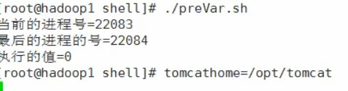

# Shell变量

## 1. shell变量简介

* Linux Shell的变量分为，系统变量和用户自定义变量
* 系统变量：$HOME、$PWD、$SHELL、$USER等等
* 显示当前shell中所有变量：set

### 1.1 变量规则

* 变量名和等号之间不能有空格，这可能和你熟悉的所有编程语言都不一样。同时，变量名的命名须遵循如下规则：
* 命名只能使用英文字母，数字和下划线，首个字符不能以数字开头。
* 中间不能有空格，可以使用下划线（_）。
* 不能使用标点符号。
* 不能使用bash里的关键字（可用help命令查看保留关键字）。
* 变量名称一般习惯为大写

### 1.2 shell变量的定义

#### 1.2.1 基本语法

* 定义变量：变量=值，=两边不能有空格
* 撤销变量：unset 变量
* 声明静态变量：readonly 变量，注意：`不能unset`

#### 1.2.2 将命令的返回值赋给变量

* A=ls -la这里有反引号（ESC下面），运行里面的命令，并把结果返回给变量A
* A=$(ls -la)等价于上面

### 1.3 使用变量

* 使用一个定义过的变量，只要在变量名前面加美元符号即可，如：

```sh
your_name="qinjx"
echo $your_name
echo ${your_name}
```

* 量名外面的花括号是可选的，加不加都行，加花括号是为了帮助解释器识别变量的边界，比如下面这种情况：

```sh
for skill in Ada Coffe Action Java; do
    echo "I am good at ${skill}Script"
done
```

### 1.4 静态变量

* 使用 readonly 命令可以将变量定义为只读变量，只读变量的值不能被改变。
* 下面的例子尝试更改只读变量，结果报错：

```sh
#!/bin/bash
myUrl="http://www.google.com"
readonly myUrl
myUrl="http://www.runoob.com"
#######
# $/bin/sh: NAME: This variable is read only.
```

### 1.5 删除变量

* 使用 unset 命令可以删除变量。语法：unset variable_name
* 变量被删除后不能再次使用。unset 命令不能删除只读变量。

### 1.6 变量类型

1. `局部变量` 局部变量在脚本或命令中定义，仅在当前shell实例中有效，其他shell启动的程序不能访问局部变量。
2. `环境变量` 所有的程序，包括shell启动的程序，都能访问环境变量，有些程序需要环境变量来保证其正常运行。必要的时候shell脚本也可以定义环境变量。
3. `shell变量` shell变量是由shell程序设置的特殊变量。shell变量中有一部分是环境变量，有一部分是局部变量，这些变量保证了shell的正常运行

## 2. 环境变量

> 所有的程序，包括shell启动的程序，都能访问环境变量，有些程序需要环境变量来保证其正常运行。必要的时候shell脚本也可以定义环境变量。

* 基本语法
* export 变量名=变量值：将shell变量输出为环境变量
* source 配置文件：让修改后的配置文件信息立即生效
* echo $变量名：查询环境变量的值

## 3. Shell 注释

* 以 # 开头的行就是注释，会被解释器忽略。
* 通过每一行加一个 # 号设置多行注释，像这样：

```sh
#--------------------------------------------
# 这是一个注释
# author：菜鸟教程
# site：www.runoob.com
# slogan：学的不仅是技术，更是梦想！
#--------------------------------------------
##### 用户配置区 开始 #####
#
#
# 这里可以添加脚本描述信息
#
#
##### 用户配置区 结束  #####
```

> 多行注释

* 多行注释还可以使用以下格式：

```sh
:<<EOF
注释内容...
注释内容...
注释内容...
EOF
```

* EOF 也可以使用其他符号:

```sh
:<<'
注释内容...
注释内容...
注释内容...
'

:<<!
注释内容...
注释内容...
注释内容...
!
```

## 4. 位置参数,预定义变量

* 我们可以在执行 Shell 脚本时，向脚本传递参数，脚本内获取参数的格式为：$n。n 代表一个数字，1 为执行脚本的第一个参数，2 为执行脚本的第二个参数，以此类推……

```sh
#!/bin/bash

echo "Shell 传递参数实例！";
echo "执行的文件名：$0";
echo "第一个参数为：$1";
echo "第二个参数为：$2";
echo "第三个参数为：$3";

:<<!
chmod +x test.sh
$ ./test.sh 1 2 3
Shell 传递参数实例！
执行的文件名：./test.sh
第一个参数为：1
第二个参数为：2
第三个参数为：3
!
```

* 另外，还有几个特殊字符用来处理参数：

参数处理|说明
---|---
\$\#|传递到脚本的参数个数
\$\*|以一个单字符串显示所有向脚本传递的参数。如"\$*"用「"」括起来的情况、以"\$1 \$2 … \$n"的形式输出所有参数。
\$$|脚本运行的当前进程ID号
$!|后台运行的最后一个进程的ID号
\$@|与\$*相同，但是使用时加引号，并在引号中返回每个参数。如"\$@"用「"」括起来的情况、以"$1" "$2" … "$n" 的形式输出所有参数。
\$-|显示Shell使用的当前选项，与set命令功能相同。
\$?|显示最后命令的退出状态。0表示没有错误，其他任何值表明有错误。

```sh
#!/bin/bash
echo "Shell 传递参数实例！";
echo "第一个参数为：$1";
echo "参数个数为：$#";
echo "传递的参数作为一个字符串显示：$*";

:<<!
$chmod +x test.sh
$./test.sh 1 2 3
Shell 传递参数实例！
第一个参数为：1
参数个数为：3
传递的参数作为一个字符串显示：1 2 3
!
```

* 预定义变量实例


