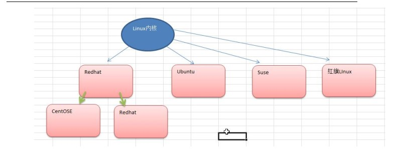
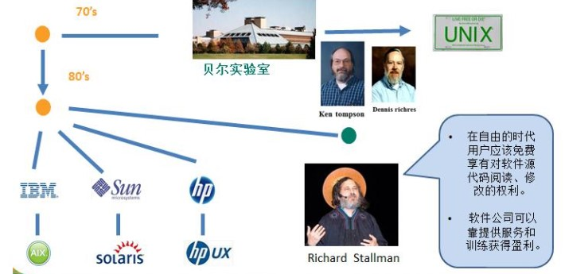
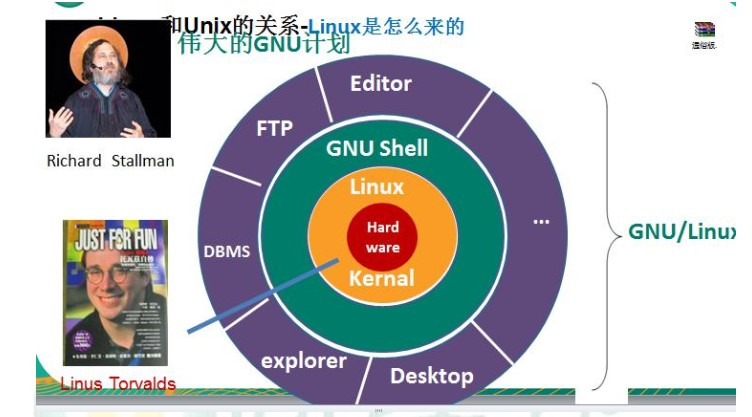
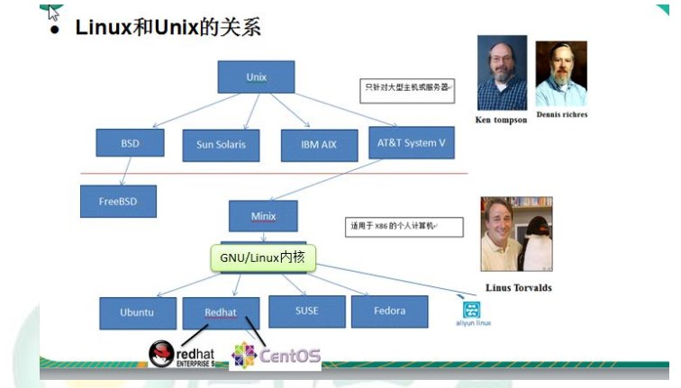

# Linux入门

## 1. Linux介绍

* Linux 是一款免费，开源，安全，高效，稳定，处理高斌发很强悍的操作系统
* Linux创始人——linux（林纳斯）
* Linux主要发行版本

## 2. Unix与Linux的关系

### 2.1 Unix来源

### 2.2 Linux来源

### 2.3 Linux与Unix关系

### 2.4 Linux与Windows关系

![Linux与Windows关系](../imgs/1/Linux与Windows关系.jpg
