# 进程管理

## 1. 进程管理基础

* 在Linux中，每个执行的**程序（代码）**都称为一个进程。每个进程都分配一个ID号
* 每一个进程，都会对应一个父进程，而这个父进程可以复制多个子进程。例如www服务器。
* 每个进程都可能以两种方式存在。前台和后台。
  * 前台进程：用户目前的屏幕上可以进行操作的。
  * 后台进程：实际在操作，但由于屏幕上无法看到的进程，通常使用后台方式执行。
* 一般系统的服务都是以后台进程的方式存在，而且都会常驻在系统中，直到关机才结束。

## 2. 显示系统执行的进程

### 2.1 ps指令详细介绍

> ps [选项]：查看目前系统中，有哪些正在执行，以及它们执行的状况

* ps -a：显示当前终端的所有进程信息。
* ps -u：以用户的格式显示进程信息。
* ps -x：显示后台进程运行的参数。
* ps -axu | grep xxx：过滤得到xxx的信息。
* ps -ef：以全格式显示当前所有的进程，查看进程的父进程。
* -e：显示所有进程。
* -f：全格式。

> ps -axu显示信息选项

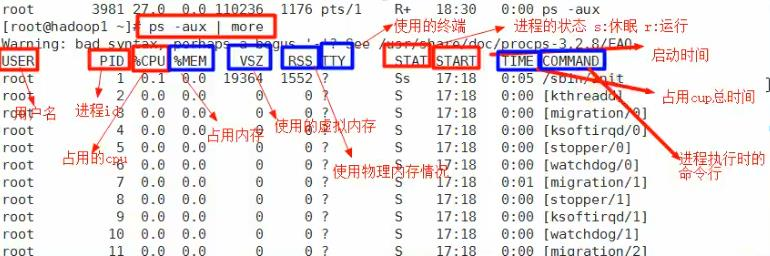

> System V 展示风格

字段|说明
---|---
USER|用户说明
PID|进程识别号
%CPU|进程占用cpu百分比
%MEM|进程占用物理内存百分比
VSZ|进程占用虚拟内存大小(KB)
RSS|进程占用物理内存大小(KB)
TTY|终端机号
STAT|进程状态，S睡眠，s代表是会话的先导进程，N代表进程拥有比普通进程更高的优先级，R正在运行，D短期等待，Z僵死进程，T被跟踪或被停止
STARTED|进程启动的时间
TIME|此进程所消耗的CPU时间
COMMAND|正在执行的命令或进程名

> ps -ef显示信息解释

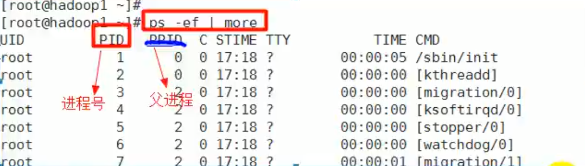

> BSD展示风格

字段|说明
---|---
UID|用户id
PID|进程id
PPID|父进程
C|CPU用于执行优先级的因子，数值越大，表明cpu密集型运算，执行优先级会降低，数值越小，表明是I/O密集运算，执行优先级会提高
STIME|进程启动时间
TTY|终端机号
TIME|此进程所消耗的CPU时间
CMD|启动所用的命令和参数

## 3. 终止进程

> 若是某个进程执行一半需要停止时，或是消耗了很大的系统资源时，此时可以考虑停止该进程，使用kill命令来完成此任务

* kill [选项] 进程号：通过进程号杀死进程
  * -9：表示强迫进程立刻停止
* killall 进程名称：通过进程名称杀死进程，也支持通配符，这在系统因负载过大而变得很慢时很有用

> 案例1：踢掉某个非法用户

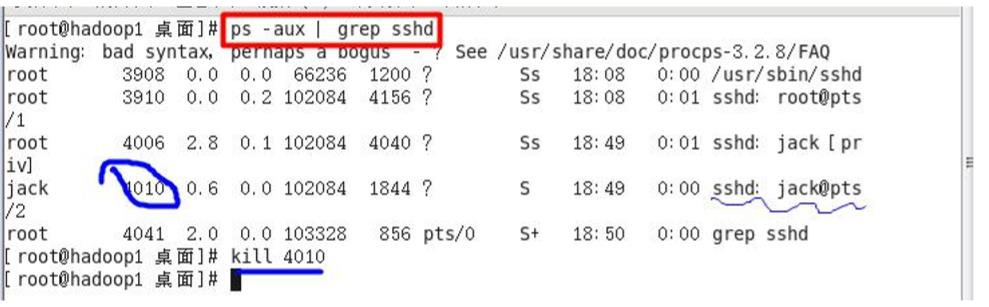

> 案例2：终止远程服务

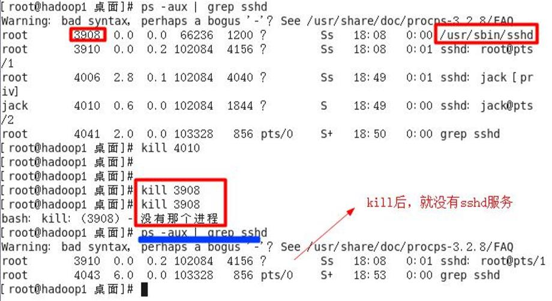

> 案例3：终止多个gedit编辑器

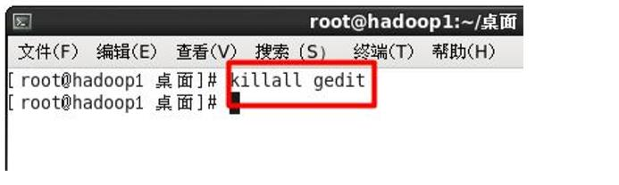

> 案例4： 强制沙雕一个终端

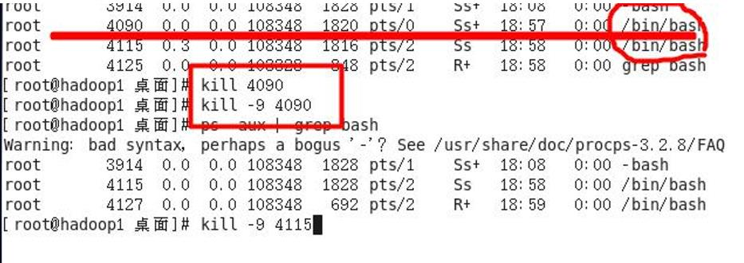

## 4. 查看进程树

* 查看进程树：pstree [选项]
  * -p：显示进程的PID
  * -u：显示进程的所属用户

## 5. 服务(Service)管理

> 服务(Service)本质就是进程，但是是运行在后台的，通常都会监听某个端口，等待其它程序的请求，比如(mysql,sshd 防火墙等),因此我们又称为守护进程。

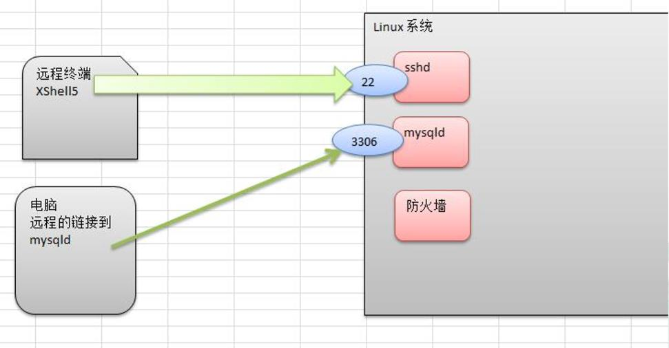

### 5.1 service管理指令

> service管理指令：service 服务名 [start | stop | restart | reload | status]
> 在CentOS7.0之后，不再使用service，而是systemctl

* 查看防火墙情况：
  * service iptables status
  * systemctl status firewalld（7.0之后的版本）
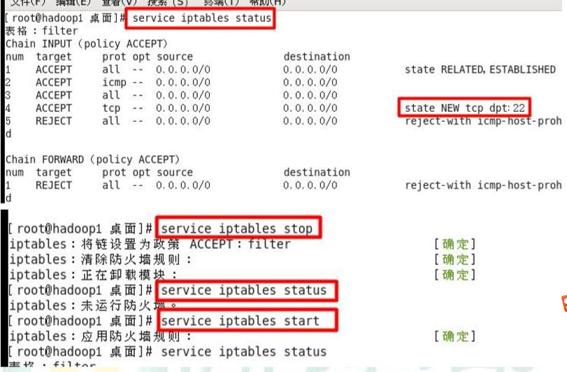

* 测试某个端口是否在监听：telnet

### 5.2 服务查看方式

* 方式1：setup指令
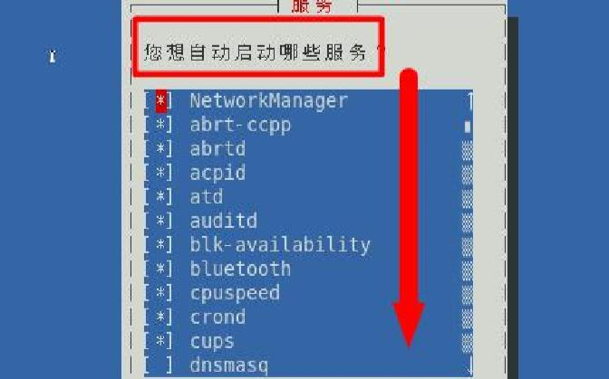
* 方式2：ls -l /etc/init.d/

### 5.3 服务的运行级别（runlevel）

* 查看或修改默认级别：vim /etc/inittab
* 每个服务对应的每个运行级别都可以设置
[详细见3.5实用指令第一部分](3.5实用指令.md)

### 5.4 开机流程

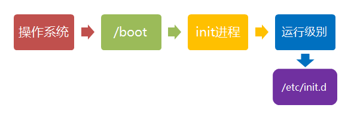

### 5.5 chkconfig指令

> chkconfig：可以给每个服务的各个运行级别设置自启动/关闭

#### 5.5.1 基本语法

* 查看xxx服务：chkconfig –list | grep xxx
* 查看服务的状态：chkconfig 服务名 --list
* 给服务的运行级别设置自启动：chkconfig –level 5 服务名 on/off
* 要所有运行级别关闭或开启：chkconfig 服务名 on/off
* **chkconfig重新设置后需要重新启动才能生效**

## 6. 动态监控进程

> top与ps相似，都是用来显示正在执行的进程，top的不同之处在于top执行一段时间可以更新正在运行的进程

### 6.1 基本语法

> top [选项]
>
>* -d 秒数：指定top命令每隔几秒更新。默认是3秒。
>* -i：使top不显示任何闲置或者僵死进程。
>* -p：通过指定监控进程ID来仅仅监控某个进程的状态。

* 交互操作说明：

操作|功能
---|---
P|以CPU使用率排序，默认就是此项
M|以内存的使用率排序
N|以PID排序
q|退出top

>动态进程监控图例

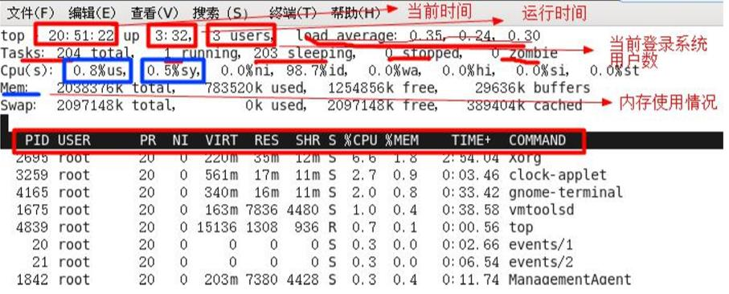

### 6.2 应用案例

#### 6.2.1  监控特定用户

1. top查看进程；
2. u
3. 输入用户名。

#### 6.2.2 终止指定的进程

1. top查看进程；
2. k输入要结束的进程。

## 7. 查看网络情况

### 7.1 基本语法

> netstat [选项]
>
> * -an：按一定顺序排列输出
> * -p：显示哪个进程在调用

### 7.2 应用案例

1. 查看所有的网络服务
    * netstat -anp | more

2. 查看sshd的服务的信息
    * netstat -anp | grep sshd
