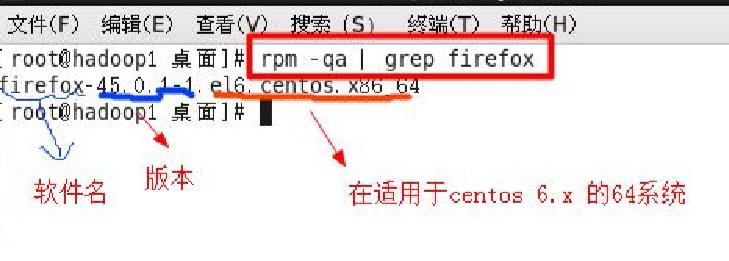

# 包管理工具

## 1. RPM包

> RPM：RedHat Package Manager，红帽软件包管理工具。
> Linuxd分发版本都有采用（suse,redhat，centos等）

### 1.1 rpm指令

#### 1.1.1 查看指令

* RPM查询已安装的rpm列表：rpm -qa | grep xx
  * 查看是否安装firefox：rpm -qa |grep firefox
  
  * 如果是i686,i386表示32位系统，noarch表示通用
* rpm -qa：查询所安装的所有rpm软件包
* rpm -qa | more
* rpm -qa | grep xx
* rpm -q xx：查询xx软件包是否安装
* rpm -qi xx：查询软件包信息
* rpm -ql xx：查询软件包中的文件
* rpm -qf 文件全路径名：查询文件所属的软件包

#### 1.1.2 卸载指令

* 卸载rpm包：rpm -e 软件包名称
* 如果其他软件依赖于要卸载的包，删除时可能会发生依赖错误
* 忽视依赖强制删除的方法：rpm -e --nodeps 软件包名称 可以强制删除，但不建议这样做，否则会导致程序无法运行

#### 1.1.3安装指令

* 安装rpm包：rpm -ivh 软件包全路径名称
  * i=install：安装
  * v=verbose：提示
  * h=hash：进度条

## 2. YUM

> yum（ Yellow dog Updater, Modified）是一个在Fedora和RedHat以及SUSE中的Shell前端软件包管理器。
>基於RPM包管理，能够从指定的服务器自动下载RPM包并且安装，可以自动处理依赖性关系，并且一次安装所有依赖的软体包，无须繁琐地一次次下载、安装。

* yum list | grep xx：查询yum服务器是否有需要安装的软件
* yum install xx：安装指定的yum包
* yum -y remove xx：卸载指定的yum包
