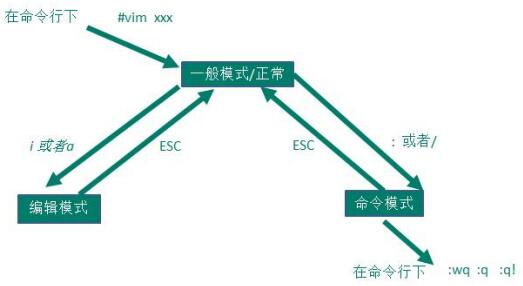

# vi和vim编辑器

## 1. vi和vim的基本介绍

* 所有Linux系统都会内置vi文本编辑器
* vim是vi的升级版，可以主动以字体颜色分辨语法的正确性，代码补完和编译，错误跳转等功能。

## 2. vi和vim的三种模式

### 2.1 正常模式

* 在正常模式下，我们可以使用快捷键。
* 用vim打开一个文件就直接进入一般模式
* 可以使用【删除字符】或【删除整行】来处理文档内容，也可以使用【复制黏贴按钮】

### 2.2 插入/编辑模式

* 在这个模式下，可以编辑文件内容。
* 按下i,I,o,O,a,A,r,R等字母就可进入编辑模式

### 2.3 命令行模式

* 在这个模式中，可以利用指令完成读取，存盘，替换，离开，显示行号的等动作。
* wq保存退出
* q无修改直接退出
* q!不保存修改直接退出

### 2.4 三种模式转换示意图

## 3. Vim 的常见指令案例

1. yy：拷贝当前行
2. 5yy：拷贝当前5行
3. dd：删除当前行
4. 5dd：删除当前行向下的5行
5. 在文件中查找某个单词：命令行输入 /（查找内容），按n查找下一个
6. 设置文件行号：set nu，取消文件行号：set nonu
7. 编辑文件，正常模式下使用快捷键到达文档最末行：G，最首行：gg
8. 撤销输入：在正常模式下输入u
9. 编辑文件，光标移动到某行：shift+g
    * 显示行号：set nu
    * 输入行号这个数
    * 输入shift+g

## 4. vim其他常见指令补充

### 4.1 文件命令

指令|说明
---|---
vim [file1 file2 file3 ...]|打开单个或多个文件
:open file|在vim窗口中打开一个新文件
:split file|在新窗口中打开文件（split打开的窗口都是横向的，使用vsplit可以纵向打开窗口。）
Ctrl+ww| 移动到下一个窗口
Ctrl+wj |移动到下方的窗口
Ctrl+wk |移动到上方的窗口
:close |最后一个窗口不能使用此命令，可以防止意外退出vim。
:only|关闭所有窗口，只保留当前窗口
:bn|切换到下一个文件
:bp|切换到上一个文件
:args|查看当前打开的文件列表，当前正在编辑的文件会用[]括起来
:e <ftp://192.168.10.76/abc.txt>| 打开远程文件，比如ftp或者share folder

### 4.2 普通模式

#### 4.2.1 插入命令

指令|说明
---|---
i |在当前位置生前插入
I |在当前行首插入
a |在当前位置后插入
A |在当前行尾插入
o |在当前行之后插入一行
O |在当前行之前插入一行

#### 4.2.2 游标移动

指令|说明
---|---
gg |移动到文件头。 = [[
G（shift + g）| 移动到文件尾。 = ]]
行數 → G|移動到第 n 行
冒号+行号，回车| 比如跳到240行就是 :240回车
h | 左移一个字符
l|右移一个字符，这个命令很少用，一般用w代替。
k |上移一个字符
j |下移一个字符
w |向前移动一个单词（光标停在单词首部）
b | 向后移动一个单词 2b 向后移动2个单词
e |同w，只不过是光标停在单词尾部
ge |同b，光标停在单词尾部。
^|移动到本行第一个非空白字符上。
0|移动到本行第一个字符上
HOME |移动到本行第一个字符。同0健。
$ |移动到行尾 3$ 移动到下面3行的行尾
f（find）| fx将找到光标后第一个为x的字符，3fd将找到第三个为d的字符。
F |同f，反向查找

#### 4.2.3 撤销和重做

指令|说明
---|---
u |撤销（Undo）
U |撤销对整行的操作
Ctrl + r |重做（Redo），即撤销的撤销。

#### 4.2.4 删除命令

指令|说明
---|---
x |删除当前字符
3x |删除当前光标开始向后三个字符
X |删除当前字符的前一个字符。X=dh
dl |删除当前字符， dl=x
dh |删除前一个字符
dd |删除当前行
dj |删除上一行
dk |删除下一行
10d |删除当前行开始的10行。
D |删除当前字符至行尾。D=d$
d$ |删除当前字符之后的所有字符（本行）
kdgg |删除当前行之前所有行（不包括当前行）
jdG（jd shift + g） |删除当前行之后所有行（不包括当前行）
:1,10d |删除1-10行
:11,$d |删除11行及以后所有的行
:1,$d |删除所有行
J(shift + j)|删除两行之间的空行，实际上是合并两行。

#### 4.2.5 拷贝，剪贴和粘贴

指令|说明
---|---
yy |拷贝当前行
nyy |拷贝当前后开始的n行，比如2yy拷贝当前行及其下一行。
p |在当前光标后粘贴,如果之前使用了yy命令来复制一行，那么就在当前行的下一行粘贴。
shift+p |在当前行前粘贴
:1,10 co 20 |将1-10行插入到第20行之后。
:1,$ co $ |将整个文件复制一份并添加到文件尾部。
ddp |交换当前行和其下一行
xp| 交换当前字符和其后一个字符
ndd|剪切当前行之后的n行。利用p命令可以对剪切的内容进行粘贴
:1,10d|将1-10行剪切。利用p命令可将剪切后的内容进行粘贴。
:1, 10 m 20 |将第1-10行移动到第20行之后。

正常模式下按v（逐字）或V（逐行）进入可视模式，然后用jklh命令移动即可选择某些行或字符，再按y即可复制

#### 4.2.6 退出命令

指令|说明
---|---
:wq |保存并退出
ZZ |保存并退出
:q! |强制退出并忽略所有更改
:e! |放弃所有修改，并打开原来文件。
:q | 未修改直接退出

#### 4.2.7 注释命令

perl程序中#开始的行为注释，所以要注释某些行，只需在行首加入#

指令|说明
---|---
3,5 s/^/#/g |注释第3-5行
3,5 s/^#//g |解除3-5行的注释
1,$ s/^/#/g |注释整个文档。
:%s/^/#/g |注释整个文档，此法更快。

### 4.3 执行shell命令

* :!command

指令|说明
---|---
:!ls |列出当前目录下文件
:!perl -c script.pl |检查perl脚本语法，可以不用退出vim，非常方便。
:!perl script.pl |执行perl脚本，可以不用退出vim，非常方便。
:suspend或Ctrl - Z |挂起vim，回到shell，按fg可以返回vim。

### 4.4 帮助命令

指令|说明
---|---
:help or F1 |显示整个帮助
:help xxx |显示xxx的帮助，比如 :help i, :help CTRL-[（即Ctrl+[的帮助）。
:help 'number' |Vim选项的帮助用单引号括起
:help \<Esc\> |特殊键的帮助用<>扩起
:help -t |Vim启动参数的帮助用-
：help i_\<Esc\>| 插入模式下Esc的帮助，某个模式下的帮助用模式_主题的模式

帮助文件中位于||之间的内容是超链接，可以用Ctrl+]进入链接，Ctrl+o（Ctrl + t）返回

### 4.5 其他非编辑命令

指令|说明
---|---
. |重复前一次命令
:set ruler?　|查看是否设置了ruler，在.vimrc中，使用set命令设制的选项都可以通过这个命令查看
:scriptnames　|查看vim脚本文件的位置，比如.vimrc文件，语法文件及plugin等。
:set list |显示非打印字符，如tab，空格，行尾等。如果tab无法显示，请确定用set lcs=tab:>-命令设置了.vimrc文件，并确保你的文件中的确有tab，如果开启了 expandtab，那么tab将被扩展为空格。

* Vim教程
  * 在Unix系统上 $ vimtutor
  * 在Windows系统上 :help tutor

* 录制宏:
  * 按q键加任意字母开始录制，再按q键结束录制（这意味着vim中的宏不可嵌套），使用的时候@加宏名，比如qa。。。q录制名为a的宏，@a使用这个宏。

* :syntax 列出已经定义的语法项
* :syntax clear 清除已定义的语法规则
* :syntax case match 大小写敏感，int和Int将视为不同的语法元素
* :syntax case ignore 大小写无关，int和Int将视为相同的语法元素，并使用同样的配色方案

## 5. Vim拓展教程

[菜鸟教程vim链接](https://www.runoob.com/linux/linux-vim.html)
