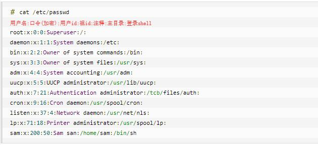
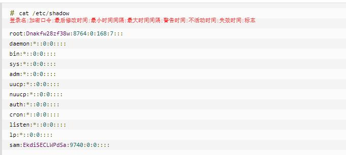
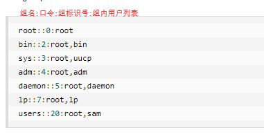

# 用户管理

## 1. 基本用户管理

> * Linux系统是一个多用户多任务的分时操作系统，任何一个要使用系统资源的用户，都必须首先向系统管理员申请一个账号，然后以这个账号的身份进入系统。
> * 用户的账号一方面可以帮助系统管理员对使用系统的用户进行跟踪，并控制他们对系统资源的访问；另一方面也可以帮助用户组织文件，并为用户提供安全性保护。
> * 每个用户账号都拥有一个唯一的用户名和各自的口令。
> * 要完成的工作主要有如下几个方面：
>   * 用户账号的添加、删除与修改。
>   * 用户口令的管理。
>   * 用户组的管理。

### 1.1 添加用户

> 添加用户：useradd [选项] 用户名。

#### 1.1.1 参数说明

* 选项:
  * -c comment 指定一段注释性描述。
  * -d 目录 指定用户主目录，如果此目录不存在，则同时使用-m选项，可以创建主目录。
  * -g 用户组 指定用户所属的用户组。
  * -G 用户组，用户组 指定用户所属的附加组。
  * -s Shell文件 指定用户的登录Shell。
  * -u 用户号 指定用户的用户号，如果同时有-o选项，则可以重复使用其他用户的标识号。
  * -f [缓冲天数] 指定在密码过期后多少天即关闭该帐号。
  * -e 有效期限 指定帐号的有效期限；
  * -M：不要自动建立用户的登入目录；

* 用户名:
  * 指定新账号的登录名。

#### 1.1.2 实例

1. useradd –d  /home/sam -m sam
    * 此命令创建了一个用户sam，其中-d和-m选项用来为登录名sam产生一个主目录 /home/sam（/home为默认的用户主目录所在的父目录）。
2. useradd -s /bin/sh -g group –G adm,root gem
    * 新建了一个用户gem，该用户的登录Shell是 /bin/sh，它属于group用户组，同时又属于adm和root用户组，其中group用户组是其主组。
  
### 1.2 用户口令的管理

> 指定和修改用户口令: passwd 选项 用户名

#### 1.2.1 参数说明

* 选项：
  * -l 锁定口令，即禁用账号。
  * -u 口令解锁。
  * -d 使账号无口令。
  * -f 强迫用户下次登录时修改口令。

#### 1.2.2 注意事项

* 如果默认用户名，则修改当前用户的口令。
  * 假设当前用户是sam，则下面的命令修改该用户自己的口令：passwd sam
* 普通用户修改自己的口令时，passwd命令会先询问原口令，验证后再要求用户输入两遍新口令，如果两次输入的口令一致，则将这个口令指定给用户；
* 超级用户为用户指定口令时，就不需要知道原口令。

#### 1.2.3 案例

1. passwd -l sam
    * 用 -l(lock) 选项锁定某一用户，使其不能登录
2. passwd -d sam
    * 为用户指定空口令

### 1.3 删除帐号

> 删除帐号: userdel 选项 用户名

#### 1.3.1 注意事项

* 常用的选项是 -r，它的作用是把用户的主目录一起删除。
  * userdel -r sam

### 1.4 修改帐号

> 修改已有用户的信息: usermod 选项 用户名

#### 1.4.1 注意事项

* 常用的选项包括-c, -d, -m, -g, -G, -s, -u以及-o等，这些选项的意义与useradd命令中的选项一样，可以为用户指定新的资源值。

### 1.5 查询用户信息

* 查询用户信息: id 用户名
  * 用户不存在是返回“无此用户”
* 查看当前用户/登录用户：who am i

### 1.6 切换用户

* 切换用户：su - 切换用户名
  * 从权限高切换到权限低的用户不需要输密码。
  * 返回切换前的用户：exit

## 2. 用户组的管理

> 每个用户都有一个用户组，系统可以对一个用户组中的所有用户进行集中管理。不同Linux 系统对用户组的规定有所不同，如Linux下的用户属于与它同名的用户组，这个用户组在创建用户时同时创建。
> 用户组的管理涉及用户组的添加、删除和修改。组的增加、删除和修改实际上就是对/etc/group文件的更新。

### 2.1 增加一个新的用户组

> 增加一个新的用户组: groupadd 选项 用户组

#### 2.1.1 说明

* 选项有：
  * -g GID 指定新用户组的组标识号（GID）。
  * -o 一般与-g选项同时使用，表示新用户组的GID可以与系统已有用户组的GID相同。

#### 2.1.2 案例

1. groupadd -g 101 group2
    * 向系统中增加了一个新组group1，新组的组标识号是在当前已有的最大组标识号的基础上加1。
2. groupadd -g 101 group2
    * 向系统中增加了一个新组group2，同时指定新组的组标识号是101。

### 2.2 删除用户组

> 删除用户组: groupmod 选项 用户组

#### 2.1.2 说明

* 选项有：
  * -g GID 为用户组指定新的组标识号。
  * -o 与-g选项同时使用，用户组的新GID可以与系统已有用户组的GID相同。
  * -n新用户组 将用户组的名字改为新名字

#### 2.1.3 案例

1. groupmod -g 102 group2
    * 将组group2的组标识号修改为102。
2. groupmod –g 10000 -n group3 group2
    * 将组group2的标识号改为10000，组名修改为group3。

### 2.3 组的切换

> 用户可以在登录后，使用命令newgrp切换到其他用户组，这个命令的参数就是目的用户组。例如：
>
> * $ newgrp root
>   * 这条命令将当前用户切换到root用户组，前提条件是root用户组确实是该用户的主组或附加组。类似于用户账号的管理，用户组的管理也可以通过集成的系统管理工具来完成。

## 3. 与用户账号有关的系统文件

### 3.1 /etc/passwd 文件

> 用户（user）的配置文件，记录用户的各种信息。

* 每行的含义：
  1. "用户名"是代表用户账号的字符串。
        * 通常长度不超过8个字符，并且由大小写字母和/或数字组成。登录名中不能有冒号\(:\)，因为冒号在这里是分隔符。
        * 为了兼容起见，登录名中最好不要包含点字符(.)，并且不使用连字符(-)和加号(+)打头。
  2. “口令”一些系统中，存放着加密后的用户口令字。
        * 虽然这个字段存放的只是用户口令的加密串，不是明文，但是由于/etc/passwd文件对所有用户都可读，所以这仍是一个安全隐患。因此，现在许多Linux 系统（如SVR4）都使用了shadow技术，把真正的加密后的用户口令字存放到/etc/shadow文件中，而在/etc/passwd文件的口令字段中只存放一个特殊的字符，例如“x”或者“*”。
  3. “用户标识号”是一个整数，系统内部用它来标识用户。
        * 一般情况下它与用户名是一一对应的。如果几个用户名对应的用户标识号是一样的，系统内部将把它们视为同一个用户，但是它们可以有不同的口令、不同的主目录以及不同的登录Shell等。
        * 通常用户标识号的取值范围是0～65 535。0是超级用户root的标识号，1～99由系统保留，作为管理账号，普通用户的标识号从100开始。在Linux系统中，这个界限是500。
  4. “组标识号”字段记录的是用户所属的用户组。
        * 它对应着/etc/group文件中的一条记录。
  5. “注释性描述”字段记录着用户的一些个人情况。
        * 例如用户的真实姓名、电话、地址等，这个字段并没有什么实际的用途。在不同的Linux 系统中，这个字段的格式并没有统一。在许多Linux系统中，这个字段存放的是一段任意的注释性描述文字，用做finger命令的输出。
  6. “主目录”，也就是用户的起始工作目录。
        * 它是用户在登录到系统之后所处的目录。在大多数系统中，各用户的主目录都被组织在同一个特定的目录下，而用户主目录的名称就是该用户的登录名。各用户对自己的主目录有读、写、执行（搜索）权限，其他用户对此目录的访问权限则根据具体情况设置。
  7. 用户登录后，要启动一个进程，负责将用户的操作传给内核，这个进程是用户登录到系统后运行的命令解释器或某个特定的程序，即Shell。
        * Shell是用户与Linux系统之间的接口。Linux的Shell有许多种，每种都有不同的特点。常用的有sh(Bourne Shell), csh(C Shell), ksh(Korn Shell), tcsh(TENEX/TOPS-20 type C Shell), bash(Bourne Again Shell)等。
        * 系统管理员可以根据系统情况和用户习惯为用户指定某个Shell。如果不指定Shell，那么系统使用sh为默认的登录Shell，即这个字段的值为/bin/sh。
        * 用户的登录Shell也可以指定为某个特定的程序（此程序不是一个命令解释器）。
        * 利用这一特点，我们可以限制用户只能运行指定的应用程序，在该应用程序运行结束后，用户就自动退出了系统。有些Linux 系统要求只有那些在系统中登记了的程序才能出现在这个字段中。
  8. 系统中有一类用户称为伪用户（pseudo users）。
        * 这些用户在/etc/passwd文件中也占有一条记录，但是不能登录，因为它们的登录Shell为空。它们的存在主要是方便系统管理，满足相应的系统进程对文件属主的要求。

        

### 3.2 /etc/shadow 文件

>口令配置文件

* 每行的含义：
  1. "登录名"是与/etc/passwd文件中的登录名相一致的用户账号
  2. "口令"字段存放的是加密后的用户口令字，长度为13个字符。如果为空，则对应用户没有口令，登录时不需要口令；如果含有不属于集合 { ./0-9A-Za-z }中的字符，则对应的用户不能登录。
  3. "最后一次修改时间"表示的是从某个时刻起，到用户最后一次修改口令时的天数。时间起点对不同的系统可能不一样。例如在SCO Linux 中，这个时间起点是1970年1月1日。
  4. "最小时间间隔"指的是两次修改口令之间所需的最小天数。
  5. "最大时间间隔"指的是口令保持有效的最大天数。
  6. "警告时间"字段表示的是从系统开始警告用户到用户密码正式失效之间的天数。
  7. "不活动时间"表示的是用户没有登录活动但账号仍能保持有效的最大天数。
  8. "失效时间"字段给出的是一个绝对的天数，如果使用了这个字段，那么就给出相应账号的生存期。期满后，该账号就不再是一个合法的账号，也就不能再用来登录了。

        

### 3.3 /etc/group 文件

>组（group）的配置文件，用户组的所有信息都存放在/etc/group文件中。

* 每行含义：
  1. "组名"是用户组的名称，由字母或数字构成。与/etc/passwd中的登录名一样，组名不应重复。
  2. "口令"字段存放的是用户组加密后的口令字。一般Linux 系统的用户组都没有口令，即这个字段一般为空，或者是*。
  3. "组标识号"与用户标识号类似，也是一个整数，被系统内部用来标识组。
  4. "组内用户列表"是属于这个组的所有用户的列表/b]，不同用户之间用逗号(,)分隔。这个用户组可能是用户的主组，也可能是附加组。

  
