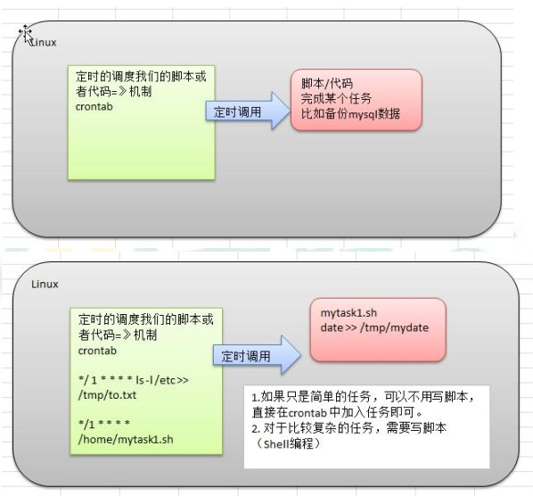

# 3.7定时任务调度

## 1. 任务调度原理

> crond任务调度：crontab进行定时任务调度  

* 使用方法：crontab [选项]
  * crontab [选项]
  * -e：编辑crontab定时任务
  * -i：查询crontab任务
  * -r：删除当前用户所有的crontab任务
  * -l：列出当前有哪些任务调度
  * service crond restart：重启任务调度
  * 当保存退出后就生效了
  * 参数细节说明

项目|含义| 范围
---|---|---
第一个“*”|一小时当中的第几分钟|0-59
第二个“*”|一天当中的第几小时|0-23
第三个“*”|一个月当中的第几天|1-31
第四个“*”|一年当中的第几月|1-12
第五个“*”|一周当中的星期几|0-7（0和7都代表星期日）

* 特殊符号说明
  * `\*：`代表任何时间。比如第一个*就代表一小时中每分钟都执行一次的意思。
  * `,：`代表不连续的时间。比如“0 8,12,16 \* * *命令”，就代表在每天的8点0分，12点0分，16点0分都执行一次命令。
  * `-：`代表连续的时间范围。比如“0 5 * * 1-6命令”，代表在周一到周六的凌晨5点0分执行命令。
  * `/n：`代表每隔多久执行一次。比如“*/10 \* * * * 命令”，代表每隔10分钟就执行一遍命令。
