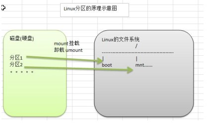
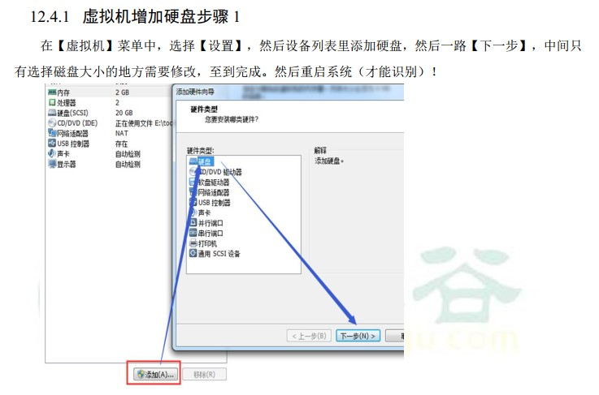
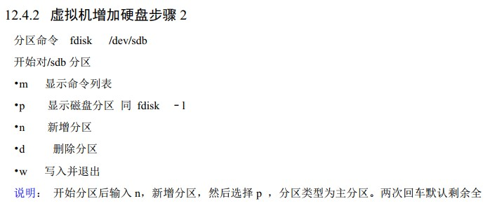
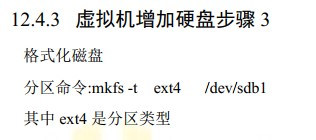
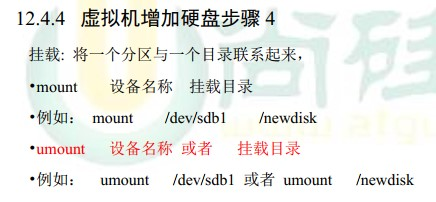
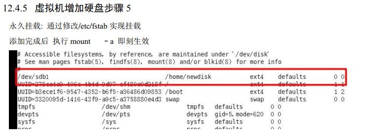
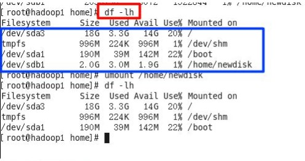
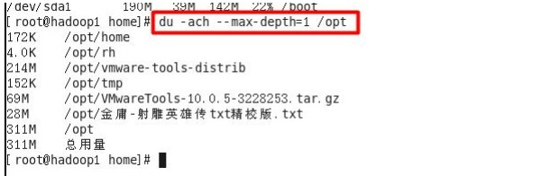
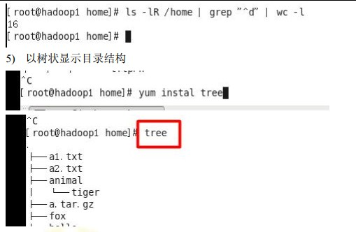

# Linux磁盘分区、挂载度

## 1. 分区方式

* mbr分区
  * 最多支持四个主分区
  * 系统只能安装在主分区
  * 扩展分区要占一个主分区
  * MBR最大只支持2TB，但拥有最好的兼容性
* gpt分区
  * 支持无限多个主分区（但操作系统可能限制，比如windows下最多128个分区）
  * 最大支持18EB的大容量（1EB=1024PB，PB=1024TB）
  * windows7 64位以后支持gpt

## 2. Linux分区

### 2.1 分区原理

* Linux来说无论有几个分区，分给哪一个目录使用，它归根结底就只有一个根目录，一个独立且唯一的文件结构，Linux中每个分区都是用来组成整个文件系统的一部分。
* Linux采用了一种叫做“载入”的处理方法，它的整个文件系统中包含了一整套的文件和目录，且将一个分区和一个目录联系起来。这时要载入的一个分区将使它的存储空间在一个目录下获得。

### 2.2 硬盘说明

* Linux硬盘分IDE硬盘和SCSI硬盘，目前基本上是SCSI硬盘
* lsblk [-f]：查看当前系统的分区和挂载情况。（list block）

### 3. 挂载硬盘

>需求是给我们的Linux系统增加一个新的硬盘，并且挂载到/home/newdisk

1. 添加硬盘
2. 分区：fdsk /dev/sdb
3. 格式化：mkfs -t ext4 /dev/sdb1
4. 挂载：新建目录：mkdir /home/newdisk；挂载：mount /dev/sdb1 /home/newdisk
5. 设置可以自动挂载（永久挂载）：重启系统后，仍然可以挂载。vim etc/fstab 增加挂载信息。mount -a：生效

### 3.1 具体步骤

#### 3.1.1 增加硬盘

#### 3.1.2 硬盘分区

#### 3.1.3 格式化磁盘

#### 3.1.4 挂载硬盘

#### 3.1.5 永久挂载

### 3.2 取消挂载

* 取消挂载：unmount /dev/sdb1

## 4. 磁盘状况查询

* 磁盘情况查询：df -h / df -l

>实例

* 查询指定目录的磁盘占用情况：du -h /目录，默认为当前目录
  * -s：指定目录占用大小汇总
  * -h：带计量单位
  * -a：含文件
  * –max-depth=1：子目录深度
  * -c：列出明细的同时，增加汇总值

>实例

* 磁盘情况-工作实用指令
  * 统计/home文件夹下文件的个数：ls -l /home | grep "^-" | wc -l
  * 统计/home文件夹下目录的个数：ls -l /home | grep "^d" | wc -l
  * 统计/home文件夹下文件的个数，包括子文件夹里的：ls -lR /home | grep "^-" | wc -l
  * 统计文件夹下目录的个数，包括子文件夹里的：ls -lR /home | grep "^d" | wc -l
  * 以树状显示目录结构：首先安装tree指令：yum install tree，tree

> 实例

