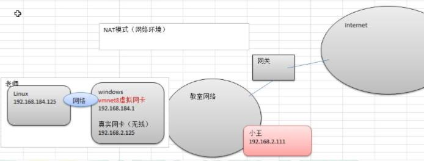
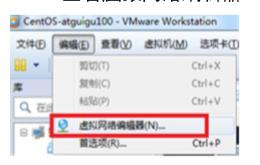
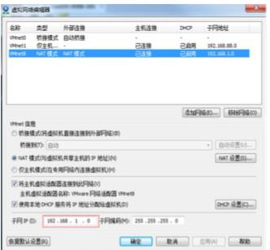
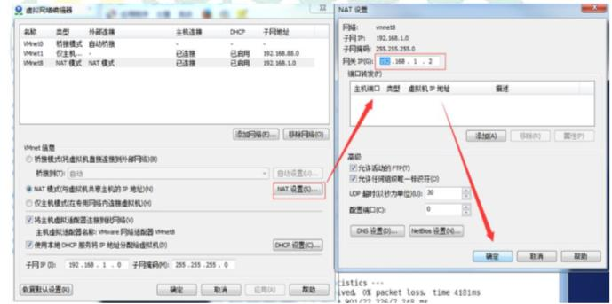
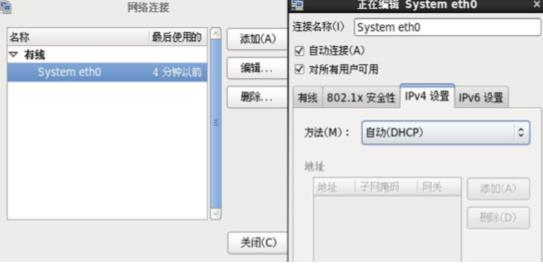
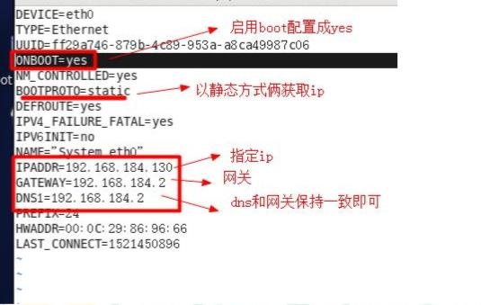
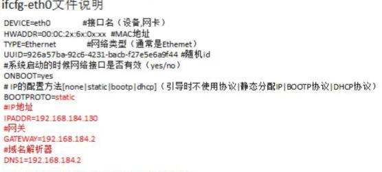

# 网络配置

## 1 Linux网络配置原理

> 虚拟机NAT网络配置原理

## 2 查看网络IP和网关

### 2.1 虚拟机网络编辑器

### 2.2 修改IP地址

### 2.3 查看网关

### 2.4 查看windows中的虚拟网卡的ip地址

* windows中使用ipconfig查看ip配置

## 3. ping测试

> 基本语法: ping [主机地址]

* 例如： ping www.baidu.com

## 4. Linux网络环境配置

### 4.1 自动抓取

**`缺点：`** 每次自动获取的ip地址可能不一样，不适用于做服务器

### 4.2 指定ip地址

1. 直接修改配置文件来指定IP，并可以连接到外网，编辑：vim /etc/sysconfig/network-scripts/ifcfg-eth0
  
2. 重启网络服务：service network restart
3. 重启系统：reboot

